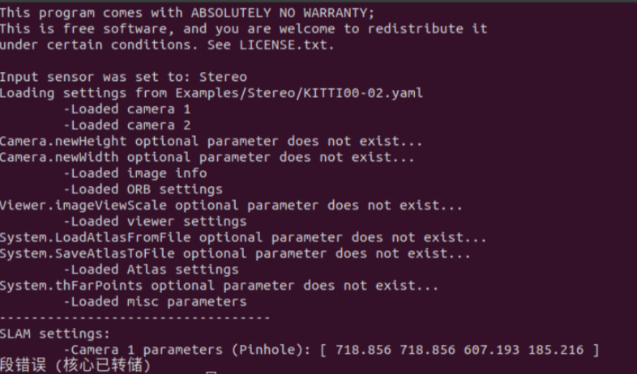

# GDB使用教程

gdb是linux系统下的调试工具,不同于vs编译器拥有图形化的调试页面,它是纯命令行的调试形式

## 1.安装 

```bash
#命令行安装
sudo apt-get install gdb
```

```bash
#检查是否安装成功
gdb --version
```

如果输出以下内容则为安装成功

```bash
cara@cara:~$ gdb --version 
GNU gdb (Ubuntu 9.2-0ubuntu1~20.04.2) 9.2
Copyright (C) 2020 Free Software Foundation, Inc.
License GPLv3+: GNU GPL version 3 or later <http://gnu.org/licenses/gpl.html>
This is free software: you are free to change and redistribute it.
There is NO WARRANTY, to the extent permitted by law.
```

## 2.使用

举例: 

```
#运行下面命令遇到段错误
rosrun ORB_SLAM3 RGBD Vocabulary/ORBvoc.txt Examples/RGB-D/2.yaml 
```



```bash
#使用gdb调试实际的可执行文件---RGBD
gdb --args ~/catkin_ws/src/ORB_SLAM3_detailed_comments-dense_map_new/Examples/ROS/ORB_SLAM3/RGBD Vocabulary/ORBvoc.txt Examples/RGB-D/2.yaml

# gdb 启动后
(gdb) run

# 程序崩溃时
(gdb) bt

#离开
(gdb) quit
```

